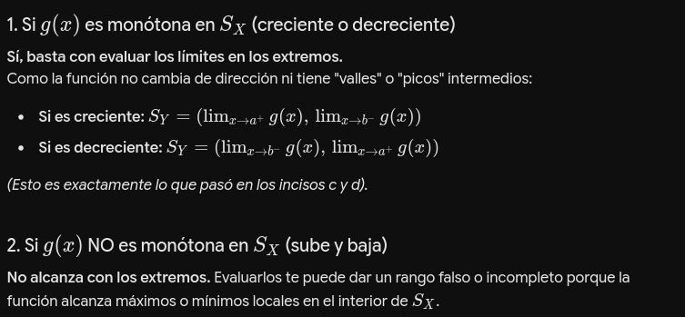

# CLASE-5
## NOTAS
### DISTRIBUCIONES CONTINUAS
**DISTRIBUCION NORMAL**: tiene dos parametros, $\mu$ y $\sigma$, donde $X \sim Normal(\mu, \sigma^{2})$ si $f(X = x | \mu, \sigma^{2}) = \frac{1}{\sqrt{2pi* \sigma}}* e ^{-\frac{(x-\mu)^{2}}{2* \sigma^{2}}}$. Dentro de esta distribucion tenemos que $E(X) = \mu$ y $VAR(X) = \sigma^{2}$, Esto se puede obtener a partir de saber que $\frac{1}{\sqrt 2pi} \int_{}^{} e^{-\frac{x^{2}}{2}} dx = 1$
Esta distribucion tendra una disitrbucion que graficada sera una campa de guass, donde el punto que define la simetria sera $\mu$, denominado como de tenencia central, y $\sigma$ sera un valor de variabilidad. Por como se define el grafico, si tomamos el valor esperado se puede ver que da bien $\mu$, tal que si tomo elementos moviendome al infinito, las probabilidad son bajas, por lo tanto lo que me queda es lo que esta mas cercano al punto medio de la misma. 

**DISTRIBUCION BETA:** Posee una disbtribucion dada por $f(x| \alpha, \beta) = \frac{1}{B(\alpha,\beta)} * x^{\alpha-1} * (1-x)^{\beta-1}$. $B(\alpha, \beta)$. importante, x esta entre 0 y 1 incluidos. Se denomina como la funcion beta. Esta funcion es muy versatil, se puede ver que cambian sus parametros, la funcion de probabilidad obtenida puede tomra multiples formas. Esto hace que sea dificil poder definir un caso de experimento estable que se asemeje a esto. Puede ser util cuando no se que dsitribucion sigue mi experimento, luego puedo ir probando con distitnos valores de alfa y beta hasta llegar a una funcion que me resulte util. $E(x) = \frac{\alpha}{\alpha + \beta}$. Luego tenemos que $VAR(X) = \frac{\alpha * \beta}{(\alpha + \beta)^{2}(\alpha + \beta + 1)}$

**DISTRIBUCION EXPONENCIAL:** Decimos que $X \sim EXP(\beta)$, donde $f(X = x|\beta) = \frac{1}{\beta}*e^{-\frac{x}{\beta}}$. Se puede tomar una funcion similar donde tomo $\lambda = \frac{1}{\beta}$ que define $f(x|\beta)  = \lambda * e^{-\lambda x}$. misma distribucion, solo tiene una forma distintas de expresarlas. 

**DISTRIBUCION DE CAUCHY:** Sera tambien una campana, pero en este caso su integral es mas dificil de calcular. $X \sim Cauchy(\theta)$, donde $f(X =x|\theta) = \frac{1}{pi}*\frac{1}{1+(x-\theta)^{2}}$. En esta, los valores va cayendo de forma polinomia, a diferencia de la normal donde cae de forma exponencial. En el caso de cacuchy, el valor medio no existe.  
Sabemos que una funcion de densidad fdp vale que $\int_{-\infty}^{\infty} f(x|\theta) dx = \int_{-\infty}^{\infty} \frac{1}{pi}*\frac{1}{1+(x-\theta)^{2}}dx = \frac{1}{pi} arctan(x-\theta)$. Al eveluar en menos infito  e infiitno obtenemos que todod es igual a 1. Mas alla de esto tenemos que $E(X) = \infty$, lo mismo aplica para la varianz, $VAR(X) = \infty$ 

**EXTRA:** para parametros 0 y 1 de la distribucion normal, decimos que sera la normal estandar.

### FUNCIONES DE UNA VARIABLE ALEATORIA
Si tengo una variable aleatoria, con una cierta distribucion, cualquier funcion de la misma va a ser una variable aleatoria en si misma. Si X es una V.A con una funcion fda de la forma $F_{X}$(x)$ entonces cualquier funcion de x, digamos $Y = g(X)$ tambien sera una V.A. Dado un conjunto A, la probabilidad  de que $P(Y \in A) = P(g(X) \in A)$. La forma de g(X) dependera tanto de la funcion que se le aplica a X como tambien de la distribucion que esta variable tenia asociada. 
$g(X)$ define un mapa desde el espacio muestral original, a el transformado. Tomemeos $S_{X}$ como el espacio muestral de X y $S_{Y}$ como el espacio muestra de Y , luego $g(x): S_{X} -> S_{Y}$. Lo definimos por la inversa: $g(A)^{-1} = \{ x \in S_{x} :g(x) \in A\}$. Luego voy trasnformando esta expresion de la siguiente manera: $g({y})^{-1} = \{ x \in S_{x} :g(x) = y\}$, tal que el evento A se construye sobre un cierto valores de y. Luego ppodemos escribir que $P(Y \in A) = P(g(X) \in A) = P(\{x\in S_{x}: g(x) \in A\}) = P(X \in g(A)^{-1})$. Esto me permite poder definir la probabilidad de los valores de Y a partir de lo que ya tengo en X. Esto implica que por ejemplo si tengo una v.a X y la aplico el cuadrado, la disrbucion de esta tranformacion no es tomar la funcion de distribucion y aplicarle el cuadrado. 

### FUNCION DE DISTRIBUCION ACUMULADA DE UNA VARIABLE TRANSFORMADA
Supongamos que tenemos $X$ e $Y$ variables continuas, calculemos la fda de $ Y = g(X)$. Quiero obtener $F_{Y}(Y) = P(Y <= y)$. A partir de eso empiezo a construir. Tengo que $F_{Y}(Y) = P(Y <= y) = P(g(X) <= y) = P(\{x \in S_{X}: g(x) <= y\}) = \int_{{x \in S_{X}: g(x) <= y}}^{} f_X(x) dx$. Se dedine en terminos de x peor viendo sobre la region de todas las x que cumplen la restriccion dada por y, es una integral en x sobre el espacio que define la transformacion. 

### RELACIONES UTILES
- $\{ x \in S_{X} : g(X) <= y\}$, si g es una funcion creciente, se puede pensar como $\{ x \in S_{X} : g(g(X))^{-1} <= g(y)^{-1}\} = \{ x \in S_{X} : x <= g(y)^{-1}\}$
- $\{ x \in S_{X} : g(X) <= y\}$, si g es una funcion dececiente, se puede pensar como como $\{ x \in S_{X} : g(g(X))^{-1} >= g(y)^{-1}\} = \{ x \in S_{X} : x >= g(y)^{-1}\}$

A partir de esto y la definicion de acumulacion dada por X, tenemos que:
- Para g creciente, $F_{Y}(y) = \int_{\{x \in S_{X} : x <= g(y)^{-1}\}}^{} f_{X}(x) dx $. Esto hace que se vuelva mas facil poder definir un limite de integracioon, tal que $F_{Y}(y) = \int_{-\infty}^{g(y)^{-1}} f_{X}(x) dx  = F_{X}(g(y))^{-1}$
- Para g decreciente, obtengo el complemento de lo de arriba. $F_{Y}(y) = \int_{\{x \in S_{X} : x >= g(y)^{-1}\}}^{} f_{X}(x) dx $. Esto hace que se vuelva mas facil poder definir un limite de integracioon, tal que $F_{Y}(y) = \int_{g(y)^{-1}}^{\infty} f_{X}(x) dx  = 1- F_{X}(g(y))^{-1}$

**TEO 2.1.3** sea $X \sim F_{X}(x) $ e $y = g(x)$. Luego vale que:
- Si g es creciente en X, luego tenemos que $F_{Y}(y) = F_{X}(g(x)^{-1})$
- Si g es decreciente en X y X es V.A continua luego $F_{Y}(y) = 1 - F_{X}(g(x)^{-1})$

Ej:
- Supongamos que tenemos $X \sim uniforme(0,1)$, para x entre cero y uno no incluidos. Sabemos que $F_{X}(x) = x$. Consideremos la transformacion, $Y = g(x) = -log(x)$. Supongamos que tengo un dado, que sigue esta dsitribucion, yo luego no uso esos valores, sino que uso la applicaion de la funcion menos logaritmo, luego podemos ver que la distribucion de estos valores calculados es exponencial. 
A partir del cirterio de la derivada, para el rango definido podemos ver que es decreciente, luego puedo aplicar el segundo caseo del teorema anterior. Luego que $Y = -log(X)$ entonces tenemos que $x = e^{-y} = g(y)^{-1}$. Luego tenemos que $F_{Y}(y) = 1 -  F_{X}(g(y)^{-1}) = 1 - F_{X}(e^{-y}) = 1 - e^{-y}$. Luego si quiero calcular $f_{Y}(y)$ directamente derivo $F_{Y}(y)$, obtengo $f_{Y}(y) = e^{-y}$ 
x
**TEO 2.1.5** seaa $X \sim f_x(x)$, $y = g(x)$ y g es monotona, donde $f_{x}(x)$ es continua y $g(y)^{-1}$ tiene derivada continua, entonces: 
- $f_{y}(y) = f_{x}(g(y)^{-1}) * \frac{dg(y)^{-1}}{dy}$ si $y \in Y$, en caso contrario dara 0. 
Demostracion:
- $f_{y}(y) = \frac{F_{Y}(y)}{dy} = f_{x}(g(x)^{-1}) * \frac{dg(y)^{-1}}{dy}$ si g es creciente o $f_{y}(y) = \frac{F_{Y}(y)}{dy} = -f_{x}(g(x)^{-1}) * \frac{dg(y)^{-1}}{dy}$ si g es creciente.
Se puede aplciar el modulo, no pierdo soluciones, en este caso compacta la forma completa. 

### TRANSFORMACION INTEGRAL DE PROBABILIDAD
**TEO 2.1.10**: sea $X \sim F_X(x)$ continua, $Y = F_{X}(x)$ entonces $Y$ esta distribuida uniformemente en (0,1), es decir $P(Y <= y) = y$ con $(0 < y < <1)$. Si tomo una X, distribida como sea, la variable Y a partir de la transofmracion dada es uniforme. No importa cual sea la funcion $F_{X}$

DEMO:
- Sabemos que $P(Y <= y) = P(F_{X}(x) <= y) = P(F_{X}[F_(X)] <= F_{X}(y)^{-1})$, suponiendo que $F_{X}^{-1}$ es creciente. Lugeo lo anterio es igual a $P(X <= F_{X}(y)^{-1}) = F{X}(F_{X}(y)^{-1}) = Y $

Verlo de forma grafica ayuda a entenderlo mejor. Si yo tengo una $F_{X}$ de cierta forma. Si empeizo a muestrear. A partir de l atrnasomfiron los poco porbables los aprieta y los que estan pegados ya no tanto, de forma tal que te da uniforme. 

## NOTAS PRACTICA
alt text