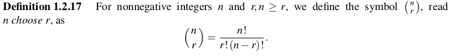
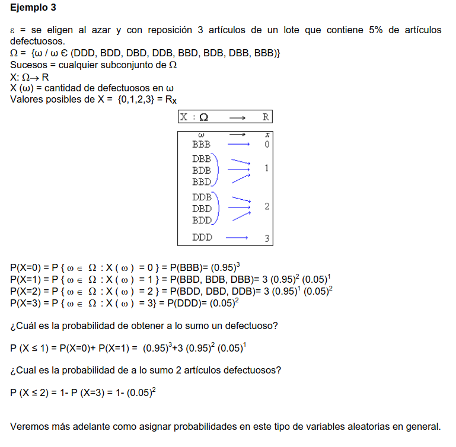
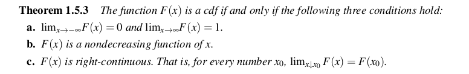
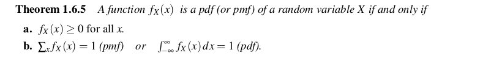
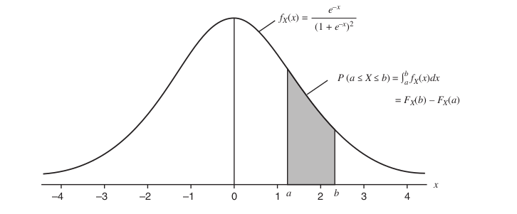
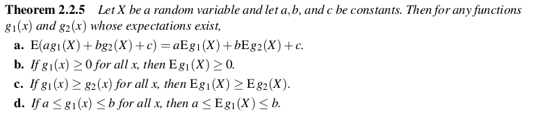

# TEORIA SOBRE PROBABILIDAD
Son los fundamentos sobre los que se construye toda la estadistica. Dando mecanismo para poder mdeolar pobaliciones o experimientos ubicados dentro de lo que se consideran como fenomenos aleatorios. 
A partir de esto se busca realizar inferencias sobre poblaciones enteras.

## CNJUNTO DE TEORIAS
**ESPACIO MUESTRAL o ESPACIO DE SAMPLEO:** Es el conjunto **S** de posibles resultados de un experimento. 
El espacio muestral puede ser contable, si tiene una correspondencia 1 a 1 con los enteros, o en caso contrario puede ser considerado como incontable. Siempre que se finito va a ser contable. 
La idea de contable o incontable solo va a tener peso cuando hablemos de asignacion de probabilidades. 
 
**SUCESO o EVENTO:** es una coleccion de posibles salidas de un experimento, siendo algun subconjunto de **S**.
Se suele estudiar la probabilidad de un **suceso**. Decimos que un **suceso** ocurre si la salida de un experimento esta dentro del **suceso**.

Los sets son conjuntos, por lo tanto aplican las operaciones de union, interseccion y complemento, entre otras. Sobre esto tambien valen propiedades de distribucion, asocitaivdad, distribucion y leyes de de morgan.

**EVENTOS DISJUNTOS**: Se dice que dos sucesos A y B son disjuntos si su interseccion es igual a el conjunto vacio. Esto se puede extender para una cantidad finita de conjuntos.

**PARTICION**: Si tengo una sucesion de conjuntos disjuntos tal que su union forma el espacio muestral **S**, entonces tenemos una particion de **S**.

## TEORIA DE PROBABILIDAD
La frecuencia con la que ocurre un resultado producto de una experiemntacion se puede considerar como una probabilidad. No se suele definir probabilidad en terminso de frecuencia, sino desde un punto de vista matematico. Se busca hacer que la probabilidad se defina por medio de una funcion que cumple ciertos axiomas. 

Para cada suceso **A** es un espacio muestral **S** queremos asociarle un numero entre 0 y 1. esto se lo llamara probabilidad de **A**, P(A).

**SIGMA ALGEBRA:** Es una coleccion de subconjuntos del espacio muestral **S**. satisface las siguientes propiedades:
- El conjunto vacio pertenece al **Sigma Algebra**.
- Si el sucesos **A** pertecene al **Sigma Algebra**, su complemento tambien
- Si un conjunto $A_i$ de sucesos pertenece al **Sigma Algebra**, su union tambien.
Por lo general nos focalizamos en el **Sigma Algebra** mas pequeño.

Si el espacio muestral **S** es finito o contable, entonces el **Sigma Algebra** sera todos los subcojuntos de **S** incluido **S**.
De ser finito el **Sigma algebra** sera el cojunto de partes.

**FUNCION DE PROBABILIDAD:** dada un espacio muestral **S** y un **Sigma algebra** asociado, una **funcion de probabilidad** es una funcion **P** con dominion sobre el **Sigma Algebra** que satisface:
- P(A) >= 0 para todo A
- P(S) = 1
- Si $A_i$ pertenece a **Sigma Algebra** y son disjuntos, luego la sumatoria de $P(A_1 U ... U A_N)$ = $\sum_{i=1}^{n} P(A_i)$

**TEOREMA:** sea **S** un espacio muestral finito. Suponiendo que tengo un **Sigma algebra** de subojuntos de **S**. Se $p_1, ...., p_n$ numeros no negativos que suman 1. Para todo **A** perteneciente a el **Sigma Algebra**, define $P(A)$ como: 
- $P(A) = \sum_{s_i pertence a A} P_i$

## AXIOMAS DE PROBABILIDAD
De la defincion de estos podemos genera distintis propiedades de las funciones de probabilidad:

**INECUACION DE BOFERRONI:** es uitl para cuando es imposible calcular la probabilidad de interseccion, pero se necesita alguna valor estimado. La idea es dar una cota tal que :
- $ P(A \cap B) \geq P(A) + P(B) - 1 $

## TEOREMAS UTILES

## CONTEO
Se utilizan distintos metodos de conteno para construir asignacion de probabilidades en espacio de muestreo finitos. Para resolver esto suele ser utili dividirlos en tareas mas pequeñas y aplicar reglas conocidas para combinarlos. 

**TEOREMA FUNDAMENTAL DE CONTEO:**  Si un trabajo de **K** tareas, donde cada tarea$ $T_i$ puede hacerce en $N_i$ maneras, entonces el trabajo entero puede hacerce en 
$N_1 X N_2 X...X N_K$ maneras.

El problema de conteo se puede dividir en:
- Conteo con reemplazo
- Conteo sin reemplazo.
A su vez tambien se debe tener en cuenta si el orden es o no importante.

A la hora de elegir una formula debo hacerme dos preguntas:
- Importa el orden?
- Se pueden repetir elementos?

### DIFERENTES CASOS DE CONTEO

Operacion a tener en cuenta al leer la tabla:

Si dice **without replacement**, implica que se puede reeptir. En caso contrario indica que no se puede repetir el elemento.

Estas tecnicas de conteo son utiles para espacio de muestro **S** que son finitos y todos sus resultados tienen la misma probabilidad de que ocurran.

## PROBABILIDAD CONDICIONAL E INDEPENDENCIA
Hasta ahora todos los casos que vimos son de **probabilidad incondicional**, todas las probabilidades fueron calculadas sobre el espacio de muestro definido. Si queremos que la misma cambie de acuerdo a nueva informacion, estamos hablando de **probabilidad condicional**.

Si **A** y **B** son eventos de **S** y $P(B) > 0$, entonces la **probabilidad condicional** de **A** dado **B**, escrito como $P(A|B)$ sera:

- $P(A|B) = \frac{P(A \cap B)}{P(B)} = \frac{P(B|A) P(A)}{P(B)}$

$P(A)$ es nuestra creencia inicial, luego llega el evento $B$ y tenemos una nueva creencia representada por $P(A|B)$

cada simbolo representa:
- P(A|B): La probabilidad posterior. la probabilidad de que ocurrio A, dado el evento B.
- P(B|A): La probabilidad previa, antes de la evidencia. es la probabilidad de que ocurra B dada que la hipotesis A es verdadera. probabilidad de B dado A.
- P(A): probabilidad de la evidencia, dado que la creencia es verdadera
- P(B): probabilidad marginal, probabilidad de la evidencia bajo cualquier circunstancia. ver cual es la probabilidad de que ocurra mas alla de cualquier condicion.

La probabilidad de **B** se puede pensar como, $P(B) = P(B|A)P(A) + P(B|A^c)P(A^c)$, donde:
$P(B|A)P(A) = $ la probabilidad de ver B en el mundo donde ocurre A
$P(B|A)P(A) = $ la probabilidad de ver B en el mundo donde no ocurre B.

la idea es que nuestro espacio muestral es actualizaco a **B**, es decir estamos actualizando el espacio muestral usando lo que ocurrio en **B**. 
La idea de condicionar es ver como cambia el espacio muestral luego de un evento sucedido.

**TEOREMA DE BAYES:** sea $A_1,A_2...$ una particion del espacio de muestreo, y sea **B** cualquier conjunto. luego para cada $i = 1,2,...$ tengo que:

- $P(A_i | B) = \frac{P(B|A_i)P(A_i)}{\sum_{j=1}^{\inf} P(B|A_j)P(A_j)}$

Donde tengo que:
- $P(A_i)$ representa la probabilidad de cada evento $A_i$
- $P(A_i|b)$ representa la probabilidad de cada evento $A_i$ dado el evento **B**.
- EL denominador representa la probabilidad de $B$.

**INDEPENDENCIA DE EVENTOS:** dos eventos son independientes si $P(A \cap B) = P(A) P(B)$

a partir de esto podemos decir que, si **A** y **B** son eventos independientes, entonces los siguientes pares tambien lo son:
- $A$ y $B^c$
- $A^c$ y $B$
- $A^c$ y $B^c$

- Una coleccion de eventos $A_1,A_2,..$ son independientes entre ellos si para toda subcoleccion $A_{i}_{1},...,A_{i}_{k}$ tenemos que:

# VARIABLES ALEATORIAS
**VARIABLE ALEATORIA:** es una funcion de un espacio de sampleo a numeros reales. Es decir sera una funcion que le asigna un valor numerico a cada resultado posible de un experimento aleatorio. Nos permite cuantificar los resultados de un evento o suceso aletario.

Al definir esto estamos obteniendo un nuevo espacio de sampleo. Podemos chequear que nuestra funcion de probabilidad tambien funcione sobre este nuevo espacio.
En algunos casos, cuando los eventos ocurridos son numeros, los valores coinciden con los de la variable aletoria.

Ver ejemplos 1.4.4, 1.4.3.

Diremos que $X = x_i$ si y solo si el resultado de un experimento aleatoria es un $s_i \in S$ tal que $X(s_j) = x_i$. luego:

- $P(X = x_i) = P({s_j \in S : X(s_j) = x_i})$

para cada valor aleatoria **X**, asociamos una funcion llamada la funcion de distribucion acumulativa:

**FUNCION ACUMULATIVA O FUNCION DE DISTRIBUCION**: Para una variable independiente **X**, la **funcion acumulativa de distrbucion** (cdf), la cual se denota como $F_x(X)$, se define como:
- $F_x(x) = P_x(X \leq x)$ para todo x.

Veamos el siguiente ejemplo de DM:

La funcion de distribucion describe el comportamiento probabilistico de una variable aleatoria **X** asociada a un experimento aleatorio. Representa la probabilidad de que una variable aleatoria tome un valor menor o igual a un cierto valor definido.

esto genera lo que se define como distribucion **DISTRIBUCION:** tabla o funcion que te dice que probabilidad tiene cada valor posible. 

En conclusiones la **Distribucion** describe como se reparte la probabilidad sobre los posibles valores de una variable aleatoria. La nocion de distrinbucion va mas alla de la fruncion que usamos, las funciones (cdf, pmf, pdf) son formas concretas de describirla.

Se define en base a la funcion de probabilidad de X.
ver definicion de 1.5.2

Se puede pensar que $F_x$ puede ser discontinua. Pero de acuerdo a como fue definida, al producirse un salto, toma el valor del tope de ese salto. Esto se conoce como **Continuidad a derecha**, la funcion es continua cuando un punto se aproxima desde la derecha.

**CONTINUIDAD:** Una variable aleatoria **X** es continua si $F_x(x)$ es una funcion continua de x. En este caso, decimos que sera continua cuando el conjunto de valores posibles son todos los valores de un intervalo o de una union de intervalos de numeros reales.
Por ejemplo, si consideramos el experimento aleatoria
consistente en medir el nivel de agua en un embalse y tomamos la variable aleatoria X=”nivel de agua”, esta puede tomar valores entre 0 y más infinito

**DISCRETA:** Una variable aleatoria **X** es discreta si $F_x(x)$ es una funcion a pasos de x. Por lo general lo que nos quiere decir es que una variable aleatoria sera discreta si su resultado es finiro o infinito numerable.
Por ejemplo, supongamos el experimento consistente en lanzar tres veces una moneda no trucada; si consideramos la variable aleatoria X=”número de caras obtenidas en los tres lanzamientos”, los valores que puede tomar esta variable aleatoria son finitos (0,1,2,3).

**DISTRIBUCION IDENTICA:** Decimos que dos varibale aleatorias **X** e **Y** son distribuidas identicamente su, para cada cojunto A perteneciente al sigma algebra, entonces $P(X \in A) = P(Y \in A)$. Esto no implica que sean iguales. 

**TEOREMA:** los siguiente oraciones son equivalentes:
- Las variables aleatorias **X** e **Y** son distribuidas identicamente.
- $F_x(x) = F_y(x)$ para todo x.

**FUNCION DE MASA DE PROBABILIDAD:** la funcion de masa de probabilidad se define sobre una variable aleatoria **X** como:
- $f_x(x) = P(X = x)$ para todo x.

Notar que para hablar de estad funciones le ponemos una letra f en minuscula.
En este caso define la probabilidad de que una variable aleatoria **X** tome un valor exacto x. Solo aplica a variables aleatorias discretas. 
Para la defincion de esta funcion en el caso de las varibales independientes discretas, podemos sumar los valores de la pmf para obtener la cdf.

para el caso de las variables aletorias continuas usamos otro nombre.

**FUNCION DE DENSIDAD DE PROBABILIDAD:** la funcion de densidad de la probabilidad $f_x(x)$, sera aquella que satisface que:
- $F_x(x) = \int_{-\infty}^{x} f_x(t) \mathrm{d}x $

Esto a su vez quiere decir que:

- $\frac{\partial }{\partial x} F_x(x)= f_x(x)$ 

La función de densidad de probabilidad (PDF) es la probabilidad que toma una variable aleatoria continua en un intervalo específico. Se evalua en intervaloes especificos.

En parte esto nos define que tanto la pdf como al pmf contienen la misma informacion que la cdf, por lo tanto debemos elegir la mas sencilla para resolver el problema.

Por le genearl la funcion de acumulativa de porbabilidad se usa cuando necesitamos hallar la probabilidad de que una variable aleatoria sea menor o igual a un valor especifico.
Por el otro lado, la pdf o pmf, se usa cuando necesitamos obtener la probabilidad sobre un valor especifico.

A la hora de definir un fenomeno en terminos de una varibale alteatorias con uan cdf $F_x(x)$, preocupara el comportamiento de la misma. 

Para una variable continua **X** tendremos que:

- $P(a < X < b) = P(a < X \leq b) = P(a \leq X < b) = P(a \leq X \leq b)$

Otra relacion importante con respecto a la integracion para ambas funciones sera que:

- $ P(a \leq X \leq b) =  \int_{a}^{b} f_x(x)dx = F_x(b) - F_x(a)$

Esto nos dice que la informacion que nos da tanto la funcion de densidad comod emasa, sera equivalente a la informacion que nos da la funcion de ditribucion acumulativa. 

# VAlORES ESPERADOS
A la hora de definir un fenomeno en terminos de una varibale alteatorias con uan cdf $F_x(x)$, preocupara el comportamiento de la misma.

**DISTRIBUCION DE FUNCION DE UNA VARIBALE ALEATORIA:** Si **X** es una variable aleatoria con una cdf $F_x(x)$, luego cualquier funcion **X**, por ejemplo $g(X)$ es tambien una variable aleatoria. Por lo general decimos que $Y = g(X)$ para denotar una nueva varibale aleatoria. 

dado que **Y** es una funcion de **X**, podemos describir el comportamiento probabilistico de **Y** en terminos de X, esto implica que para cada set **A** tengo que:

- $P(Y \in A) = P(g(X) \in A)$

muestra que la distribucion **Y** depende de las funcion $F_x$ y **g**.

ademas, si escribimos $y = g(x)$ , la funcion $g(x)$ define un nuevo espacio de mapeo del espacio muestral inicial **X**.

Esto define la idea de **TRANSFORMACION**. Dado una varibale independiente **X**, yo le aplico una funcion, definiendo una nueva variable independiente **Y** tal que, $Y = g(X)$

Ya sabemos como se distribuye **X**, luego **Y** sera una nueva variable a la cual queremos entender. Donde aplicaremos que:

- $P(Y = y) = P(g(X) = y)$

Una transformacion no cambia las porbabilidades, solo la forma en la que se observa. Reagrupa los valores de **X** en terminos de **Y**.

**VALOR ESPERADO o ESPERANZA**: Dado una variable aleatoria, el valor esperado de la misma es casi el promedio de su valor, donde cuando decimos promedio nos referimos a un valor que es medido de acuerdo a la probabilidad de distribucion. 
Por medio de pesar los valores de una variable aleatoria, de acuerdo a la dsitrbucion de probabilidad, esperamos obyener un numero que resuman un valor tipico y esperado de uan observacion sobre una varibale aleatoria.

Dado una variable aleatoria $g(X)$, denotada como $Eg(x)$, la esperanza sera:

$g(X)$ representa la posibilidad de utilizar alguna tranformacion de una varibale independiente $X$, pero se puede tomar tambien a $g(X) = X$.

En resumen en la esperanza sera un valor que nos indica el valor promedio que se espera obtener de una variable aleatoria a largo plazo. Es decir, si repito el experimento muchas veces, la esperanza nos dice cual sera el resultado promedio. Nos da una idea de un comportamiento general a largo plazo.

**VARIANZA:** es una medida de la deispersion de una distribucion. Sea **X** una variable aleatoria con $\mu$ igual a su media, es decir $\mu = E(X)$. luego la varianza de **X** se define como:

- $ VAR(X) = \sigma = E(X- \mu)² = \int_{}{} (x-\mu)² \mathrm{d}F(X) $

la desviacion estandar de **X** se define como $\sqrt {VAR(X)}$

**FAMILIAS DE DISTRIBUCIONES COMUNES**
Para poder modelar poblaciones, en general trabajamos con con familias de distribuciones. Las familias son idexadas por mas de un parametro. 
Cada una por lo general tendra una esperanza y varianza definida, donde para cada una habra aplicaciones basicas definidas. 

Cuando hablamos de familias de distribuciones nos referimos a un conjunto de distribuciones que:
- Comparten forma general.
- Dependen de ciertos parametros.
Es decir uan familia de distribuciones tiene una misma funcion general parametrizada.

### DISTRIBUCIONES DISCRETAS: 
una variable independeinte **X** tiene una distribucion uniforme si, la distribucion es:

- $P(X = x|N) = \frac{1}{N}$ con $x = 1,2,3....N$.

la distribucion da la misma masa para cada posible resultado 1,2..N. a su vez tenemos que:

- $EX = \frac{N+1}{2}$
- $VAR X = \frac{(N+1)(N-1)}{12}$

Sera una distribucion para variables aleatorias **DISCRETAS**
Notar que usamos |N para referirinos a que la distribucion depende de ciertos parametros. 

**DISTRIBUCIONES HYPERGEOMETRICA:**
Supongamos que tenemos una urna llena de **N** pelotas que son identicas en todos sus aspecto menos en que tengo **M** pelotas rojas y **N-M** pelotas verdes. Con los ojos cerrados intentamos elegir **K** pelotas. cual es la probailidad de **k** sean rojas?
para lograr esto debo elegir **x** pelotas de las **M** rojas.  A su vez debo elegir **(K-x)** pelotas verdes de las **(N-M)** pelotas verdes totales. todo esto divido por las **K**  pelotas elegidas sobre las **N** totales.
Formula general:

El rango de **X** a su vez tiene restricciones adicionales, donde:
- $M \geq x$
- $N- M \geq K-x$

lo que da que:

- $M-(N-K) \leq x \leq M$

Esta ditribucion muestra lo dificil de trabajar con poblaciones finitas.

**FALTA LA DEFINCION DE ESPERANZA Y VARIANZA**

**DISTRIBUCION DE BERNOULLI:**
Una variable independiente **X** posee una distribucion de bernoulli si: 

- $X = \begin{cases}
        1  & \text{con probilidad p}\\
        0  & \text{con probilidad 1-p}
       \end{cases}$

Donde $0 \leq p \leq 1$. Luego tengo que
- $EX = p$
- $VAR X = p(1-p)$

Muchos esperimentos pueden ser modelas como una secuencia de ensayos de bernoulli. El mas sencillo es repetir el lanzamiento de una moneda donde $ P = \text{probilidad de conseguir cara}$, luego $X = 1$ es si la moneda mostro cara. 

**DISTRIBUCION BINOMIAL:**
A partir de bernoulli podemos definri esta distribucion. Si b juicion de bernoulli son realizados, donde cada evento esta definido de la form:

- $A_i $ = {X = 1 \text{en el jucicio i}}$

tomando que todos los eventos son independientes. Es facil determinar la distribucion de numeros totales de exito en **n** juicios. Si definimos una variables aleatoria **Y** donde:

- $ Y = numero total de exitos en n juicios$
 
El evento ${Y = y}$ ocurre solo si de $A_i$ eventos, solo **y** tienen exito. Luego una posible resutlado de esto sera $A_1 \cap A_2 \cap A^c_3 \cap ... \cap A_{n-1} \cap A^c_n$ donde la probilidad de esto sera:

- $P(A_1 \cap A_2 \cap A^c_3 \cap ... \cap A_{n-1} \cap A^c_n) = pp(1-p)...p(1-p) = p^y(1-p)^{n-y}$

Luego puedo elegir y distintas secuencias de n. por lo teanto la forma ds distribuccion binomial sera:

$P(Y = y |n,p) = \binom{n}{y}p^y(1-p)^{n-y}$ 

La variable **Y** puede tomar distintas formas, donde dado una serie de **n** jucios de bernoulli, donde cada uno tiene probilidad p, definidas la variables aleatorias $X_1, .., X_n$
luego:

- $X_i = \begin{cases}
        1  & \text{con probilidad p}\\
        0  & \text{con probilidad 1-p}
       \end{cases}$

luego tenemos que:
- $Y = \sum_{i=1}^{n} X_i$

Para esta distribucion tenemos que, si **X** posee una distrbibucion **binomial(n,p)**, luego:

- $EX = n.p$
- $VAR X = n.p(1-p)$

**DISTRIBUCION DE POISSON:**
Se suele usar para modelar fenomenos donde estamos esperando que algo ocurrar, como por ejemplo esperando un colectivo, esperando que un consumidor aparezca en un banoc, etc. 
El numero de ocurrencias dentro de un intervalo de tiempo pueden ser modelados con esta distribucion.
Tambien puede ser usada para distribucion espacial, como por ejemplo la distribucion de impactos de bomba en un area o la distrbucion de peces en un lago. La formula sera:

- $P(X = x|\lambda) = \frac{e^{-\lambda} \lambda^x}{x!}$

El parametro $\lambda$ se lo suele llamar parametro de intensidad. A su vez tenemos que:

- $EX = \lambda$
- $VARX = \lambda $

**DISTRIBUCION BINOMIAL NEGATIVA:**
En este caso nos permite contar el numero de de juicios de bernoulli necesarios para obtener un numeros de exitos. En una secuencia de juicios de bernoulli, definamos a **X** como el juicio donde el suceso numero **r** ocurre, donde **r** es un entero fijo.luego:

- $P(X = x|r,p) = \binom{x-1}{r-1}p^r(1-p)^{x-r}$

el evento {X = x} puede ocurrir solo si hay exactamente **r-1** exitos en **x-1** juicios, y un sueceso en el jucio **x**. la probilidad de **r-1** exitos en **x-1** juciios es la probabilidad binomila dada por $\binom{x-1}{r-1}p^{r-1}(1-p)^{x-r}$

A veces la distribucion negativa puede definirse en terminos de la variables independiente $Y= \text{numero de fracasos en antes de r sucesos}$. Es lo mismo a la dada en terminos de **X**. De esta forma, podemos dar una formula alternativa:

- $P(Y = y) = \binom{r+y-1}{y}p^r(1-p)^{y}$

En este caso tenemos que $Y = X-r$

Luego podemos definir que:

- $EY = r\frac{1-p}{p}$ 
- $VARY = \frac{r(1-p)}{p^2}$

Tanto la disttribucion de poisson como la distribucion binomial puede ser utilizados para modelar fenomenos en los cuales estamos esperando que ocurra algo.

**DISTRIBUCION GEOMETRICA**
Es un caso especial de la distribucion binomial negativa. Si establecemos que $r = 1$, entonces tenemos que:

- $P(X = x|p) = p(1-p)^{x-1} $

Que define la pmf de una variable aleatoria geoemtrica con probabilidad p. En este caso **X** puede ser interpretada como el juicio en el cual el primer exito ocurre, estamos esperando por el exito.

- $EX = \frac{1}{p}$
- $VARX = \frac{1-p}{p^2}$

una propiedad importante de la distribucion geometrica es que:

- $P(X > s|X> t) = P(X > s-t)$

La idea es que esta distribucion olivida lo que paso, la probabilidad de obtener $s-t$ fracasos adicionales, habiendo observado ya $t$, es lo que mismo que la probabilidad de observar $s-t$ fracasos al principio de la secuencia. 

Esta propiedad nos indica que esta distribucion no es buena para modelar procesos con cierta vida, donde se espera que el fracaso crezca con el tiempo. Otra forma de pensarlo es como:

- $P(X > s + t|X > s) = P(X > t)$

### DISTRIBUCIONES CONTINUAS
**DISTRIBUCION UNIFORME:***
Se define por medio de repatir la masa de forma uniforme sobre el intervalo $[a,b]$. la pdf tendra ls siguiente forma:

- $f(x|a,b) = \begin{cases}
                \frac{1}{b-a} & \text{si x pertenece a [a,b]}\\
                0 & \text{en lo contrario}
                \end{cases}$

luego:

$EX = \frac{b+a}{2}$
$VAR X = \frac{(b-a)^2}{12}$

**DISTRIBUCION GAMMA**
es una familia de distribucion sobre $[0,\infty)$. Tenemos que la pdf sera:

- $f(t) = \frac{t^{\alpha -1}e^{-t}}{\Gamma(\alpha)}$

para $0 < t < \infty$. donde tenemos que:

- $\Gamma(\alpha) = \int_0^{\infty} t^{\alpha-1}e^{-t} \mathrm{d}t $

el parametro $\alpha$ se suele conocer como el parametro de forma, siendo el que mas influye en la distribucion.

- $EX = ?$
- $VAR x = ?$

**DISTRIBUSION NORMAL O DISTRIBUCION GAUSSIANA**
caracteristicas de esta distribucion:
- Esta tipo de distribucion y las asociadas a la misma son faciles de seguir desde el punto de vista analitico
- tiene una forma de campana por lo que son simetricas, algo que es muy buscado en muchos modelos de poblaciones.
- se cumple el **teorema de limite central**, bajo condiciones leves, la distribucion normal puede ser uasada para aproximar una gran variedad de distribuciones en grandes muestreos. la formula de la pdf sera:

- $f(x|\mu \ \sigma^2) = \frac{1}{\sqrt{2 \pi \sigma }} \ e^{-(x-\mu)^{2}/(2\sigma^{2})}$

los parametros seran $\mu$ y $\sigma^{2}$ que representar la esperanza y la varianza.

Esta distribucion es especial debido a que sos parametros nos proveen informacion completa sobre la forma y ubicacion exacta de la distribucion.

Si una variable a aletoria posee una distribucion norma tal que $normal(\mu,\sigma^2)$, luego puedo transforma a la variable aleatoria $Z = (X-\mu)/ \sigma$ que posee una dsitribucion $normal(0,1)$, conodifo como la **normal estandar**.

Esto nos dice que toda distribucio normla puede ser calculada en terminso de la distrbucion normal estandar, dandonos una forma mas sencilla de obtener la probailidad con algo conocido. 

**CAUCHY DISTRIBUTION**
Posee una forma de campana, definda sobre $(-\infty,\infty)$ con una pdf de la forma:

- $f(x|\theta) = \frac{1}{\pi} \ \frac{1}{1+(x-\theta)^{2}}$

En este caso no existe la media en esta distribucion. Este tipo de distribucion representa un caso extremo contra el cual pueden ser puesta a prueba ciertas conjeturas. 

**DISTRIBUCION EXPONENCIAL**
Es un caso especial de la distribucion gamma. la pdf tendra la siguiente forma:

- $f(x|p) = \frac{1}{\Gamma(p/2)2^{p/2}}x^{(p/2)-1}e^{-x/2}$

La distrbucion exponencial puede ser utilizada para modelar fenomenos de vida. Es analoga al caso de la distrbucion geometrica en el caso de las discretas.

tiene la falta de memoria, por que sirve para modelar procesos de vida???

## INECUACIONES E IDENTIDADES
**DESIGUALDAD DE CHERYSHEV:** dada una variable independiente **X** y una funcion$ g(x)$ no negativa. luego para todo $r >0$ tengo que:

- $P(g(X) \geq r) \leq \frac{Eg(x)}{r}$

## DISTRIBUCIONES CONJUNTAS
En esta caso vamos a empezar a hablar de modelo que incluyen mas de una variable independiente, estos seran modelos mutivariable.

veamos algunas definciones que seran de ayuda:
**VECTOR ALEATORIO DE DIMENSION N:** es una funcion de un espacio de muestro **S** a $R^{n}$, un espacio euclidio de dimension $n$.

Un ejemplo puede ser un problema donde tiramos dos dados. El epsacio muestral va esta formado por tupla donde tengo: (el valor del primer dado, el valor del segundo dado).
Luego puedo definir dos variables aleatorias, X e Y tal que:
- $X = \text{la suma de ambos dados}$
- $Y = |\text{la diferencia de ambos dados}|$

De esta forma tenes un vector aleatoria de dimension dos de la forma $(X,Y)$. Ahora debemos definir las probabilidad des los eventos en terminos de $(X,Y)$, por ejemplo, que representa $P(X = 5 & Y = 3)$. En este casos solo tenemos dos evento que cumple esto, {(4,1),(1,4)}, luego la probabilidad sera de $\frac{2}{36}$.

El vector definido arriba sera cocebido como discreto, dada que solo posee un numero contable de posibles valores. 

**FUNCION DE MASA DE PORBABILIDAD CONJUNTA:** sea $(X,Y)$ un vector aleatorio de dimension 2 discreto. la funcion $f(x,y)$ de $R^{2}$ a $R$ se define como $f(x,y) = P(X = x, Y = y)$.
Se suele notar como $f_{X \ Y}(x,y)$.

esta pmf define la probabilidad de distribucion 