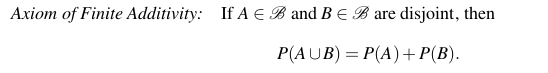
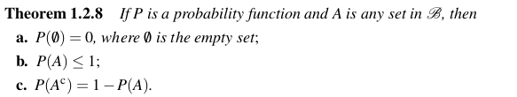
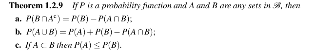
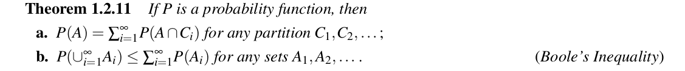
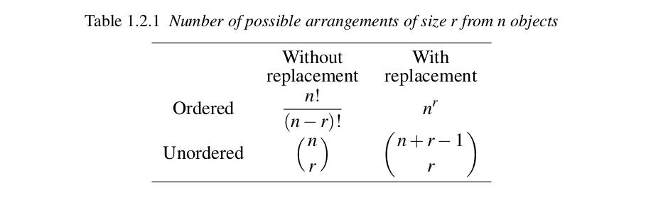

# TEORIA SOBRE PROBABILIDAD
Son los fundamentos sobre los que se construye toda la estadistica. Dando mecanismo para poder mdeolar pobaliciones o experimientos ubicados dentro de lo que se consideran como fenomenos aleatorios. 
A partir de esto se busca realizar inferencias sobre poblaciones enteras.

## CNJUNTO DE TEORIAS
**ESPACIO MUESTRAL o ESPACIO DE SAMPLEO:** Es el conjunto **S** de posibles resultados de un experimento. 
El espacio muestral puede ser contable, si tiene una correspondencia 1 a 1 con los enteros, o en caso contrario puede ser considerado como incontable. Siempre que se finito va a ser contable. 
La idea de contable o incontable solo va a tener peso cuando hablemos de asignacion de probabilidades. 
 
**SUCESO o EVENTO:** es una coleccion de posibles salidas de un experimento, siendo algun subconjunto de **S**.
Se suele estudiar la probabilidad de un **suceso**. Decimos que un **suceso** ocurre si la salida de un experimento esta dentro del **suceso**.

Los sets son conjuntos, por lo tanto aplican las operaciones de union, interseccion y complemento, entre otras. Sobre esto tambien valen propiedades de distribucion, asocitaivdad, distribucion y leyes de de morgan.

**EVENTOS DISJUNTOS**: Se dice que dos sucesos A y B son disjuntos si su interseccion es igual a el conjunto vacio. Esto se puede extender para una cantidad finita de conjuntos.

**PARTICION**: Si tengo una sucesion de conjuntos disjuntos tal que su union forma el espacio muestral **S**, entonces tenemos una particion de **S**.

## TEORIA DE PROBABILIDAD
La frecuencia con la que ocurre un resultado producto de una experiemntacion se puede considerar como una probabilidad. No se suele definir probabilidad en terminso de frecuencia, sino desde un punto de vista matematico. Se busca hacer que la probabilidad se defina por medio de una funcion que cumple ciertos axiomas. 

Para cada suceso **A** es un espacio muestral **S** queremos asociarle un numero entre 0 y 1. esto se lo llamara probabilidad de **A**, P(A).

**SIGMA ALGEBRA:** Es una coleccion de subconjuntos del espacio muestral **S**. satisface las siguientes propiedades:
- El conjunto vacio pertenece al **Sigma Algebra**.
- Si el sucesos **A** pertecene al **Sigma Algebra**, su complemento tambien
- Si un conjunto $A_i$ de sucesos pertenece al **Sigma Algebra**, su union tambien.
Por lo general nos focalizamos en el **Sigma Algebra** mas pequeño.

Si el espacio muestral **S** es finito o contable, entonces el **Sigma Algebra** sera todos los subcojuntos de **S** incluido **S**.
De ser finito el **Sigma algebra** sera el cojunto de partes.

**FUNCION DE PROBABILIDAD:** dada un espacio muestral **S** y un **Sigma algebra** asociado, una **funcion de probabilidad** es una funcion **P** con dominion sobre el **Sigma Algebra** que satisface:
- P(A) >= 0 para todo A
- P(S) = 1
- Si $A_i$ pertenece a **Sigma Algebra** y son disjuntos, luego la sumatoria de $P(A_1 U ... U A_N)$ = $\sum_{i=1}^{n} P(A_i)$

**TEOREMA:** sea **S** un espacio muestral finito. Suponiendo que tengo un **Sigma algebra** de subojuntos de **S**. Se $p_1, ...., p_n$ numeros no negativos que suman 1. Para todo **A** perteneciente a el **Sigma Algebra**, define $P(A)$ como: 
- $P(A) = \sum_{s_i pertence a A} P_i$

## AXIOMAS DE PROBABILIDAD
De la defincion de estos podemos genera distintis propiedades de las funciones de probabilidad:

**INECUACION DE BOFERRONI:** es uitl para cuando es imposible calcular la probabilidad de interseccion, pero se necesita alguna valor estimado. La idea es dar una cota tal que :
- $ P(A \cap B) \geq P(A) + P(B) - 1 $

## TEOREMAS UTILES

## CONTEO
Se utilizan distintos metodos de conteno para construir asignacion de probabilidades en espacio de muestreo finitos. Para resolver esto suele ser utili dividirlos en tareas mas pequeñas y aplicar reglas conocidas para combinarlos. 

**TEOREMA FUNDAMENTAL DE CONTEO:**  Si un trabjo de **K** tareas, donde cada tarea$ $T_i$ puede hacerce en $N_i$ maneras, entonces el trabajo entero puede hacerce en 
$N_1 X N_2 X...X N_K$ maneras.

El porblema de conteo se puede dividir en:
- Conteo con reemplazo
- Conteo sin reemplazo.
A su vez tambien se debe tener en cuenta si el orden es o no importante.

### DIFERENTES CASOS DE CONTEO

